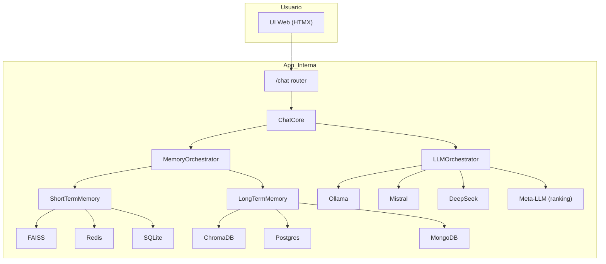
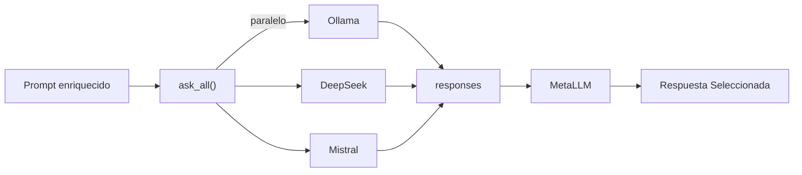

# ai_assist

Este documento describe la arquitectura actual de **ai_assist**, un asistente inteligente modular que integra múltiples modelos LLM y adaptadores de memoria para generar respuestas informadas con capacidad de análisis contextual profundo y meta-análisis entre modelos.

---

## 1. Arquitectura General



---

## 2. Memoria: Arquitectura y Comportamiento

### 2.1. Short-Term Memory (STM)

- **Propósito:** Rápido acceso a interacciones recientes.
- **Adaptadores disponibles:**
  - **FAISS:** Búsqueda vectorial local.
  - **Redis:** Búsqueda parcial y por clave-valor.
  - **SQLite:** Soporte SQL + metadatos.
- **Controlado por:** `ShortTermMemory → MemoryOrchestrator`

### 2.2. Long-Term Memory (LTM)

- **Propósito:** Recuperar información relevante histórica, persistente o cruzada.
- **Adaptadores disponibles:**
  - **ChromaDB:** Base vectorial.
  - **PostgreSQL:** Datos estructurados.
  - **MongoDB:** Datos documentales.
- **Controlado por:** `LongTermMemory → MemoryOrchestrator`

### 2.3. Orquestador de Memoria

- Decide dónde guardar y consultar cada interacción.
- Permite fusión de contexto corto y largo.

---

## 3. Orquestador de LLMs

### 3.1. Objetivo

- Ejecutar consultas a varios LLMs en paralelo.
- Realizar un meta-análisis y elegir la mejor respuesta basada en contexto y consistencia.

### 3.2. Componentes

- **LLMOrchestrator:** Gestiona llamadas paralelas a los modelos.
- **MetaLLM:** Evalúa las respuestas candidatas y escoge la mejor usando un prompt especializado.
- **Soporta:** Ollama, Mistral, DeepSeek (modular y ampliable)



---

## 4. ChatCore: Integración

- **Responsabilidad:** Actúa como página central de orquestación entre la memoria y el sistema de LLMs.
- Consulta STM y LTM desde MemoryOrchestrator.
- Fusiona el contexto usando el PromptBuilder.
- Ejecuta el orquestador de LLMs.
- Guarda resultados en memoria.

---

## 5. Interfaz Web

- **index.html:** Terminal estilo retro usando Bootstrap 386.
- Usa HTMX para interacción asíncrona sin recarga.
- Separada lógicamente en carpeta `web/`:
  - `templates/`
  - `static/`
  - `routes/`
  - `utils/`

---

## 6. Flujo de Datos Simplificado

1. Usuario envía mensaje.
2. ChatRouter lo pasa a ChatCore.
3. Se consulta STM y LTM → contexto.
4. Se construye el prompt.
5. Se consulta el orquestador de LLMs.
6. Se evalúa con MetaLLM y se selecciona la mejor respuesta.
7. Se guarda en memorias.
8. Se responde a la interfaz.

---

## 7. Futuro Inmediato

- Agregar módulo de tareas asíncronas (e.g. cron_core, web_crawler_core).
- Mejorar interfaz editable de memoria.
- Soporte para roles/agentes paralelos.
- Persistencia avanzada y backups cifrados.

---

## 8. Stack Principal

- **FastAPI** (servidor principal)
- **HTMX** (frontend interactivo)
- **Chroma, FAISS, Redis, PostgreSQL, MongoDB** (backends de memoria)
- **Jinja2** (templates dinámicos)
- **LLMs:** Mistral, DeepSeek, Ollama
- **Docker Ready** (localhost y redes internas)

---

## Prerequisitos

- Python 3 y pip (pre-instalados en el dev container)
- Todas las dependencias listadas en `requirements.txt`

---

## Instalación

Instala todas las dependencias de Python:

```bash
pip3 install -r requirements.txt
```

---

## Ejecución de la Aplicación

Inicia la app FastAPI usando **uvicorn**:

```bash
uvicorn main:app --reload
```

- Reemplaza `main:app` si tu punto de entrada es diferente.
- El flag `--reload` habilita recarga automática para desarrollo.

Una vez corriendo, abre la app en tu navegador por defecto:

```bash
"$BROWSER" http://localhost:8000
```

---

## Ejecución de Tests

Si tienes tests configurados (por ejemplo, con pytest):

```bash
pytest
```

---

## Estructura del Proyecto

- `main.py` — Punto de entrada principal para la app FastAPI
- `requirements.txt` — Dependencias de Python
- Módulos y archivos de configuración adicionales según necesidad

---

## Notas

- Todos los comandos deben ejecutarse dentro del dev container.
- Para más información sobre FastAPI, consulta la [documentación oficial de FastAPI](https://fastapi.tiangolo.com/).